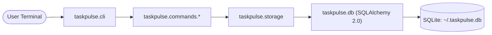

# TaskPulse

[](https://github.com/owoaanu/git-workflow/actions/workflows/lint-and-test.yml)
[](https://www.python.org/downloads/)
[](https://github.com/psf/black)
[](https://opensource.org/licenses/MIT)

**TaskPulse** is a clean, modular Python CLI task manager designed as a starter repository for interns and new contributors to practice production-grade Git workflows, collaborative code reviews, and automated testing.

---

## Architecture & Directory Layout

TaskPulse uses modern **SQLAlchemy 2.0** ORM for type-safe database models and queries with SQLite, paired with Python's built-in `argparse` for a clean, modular CLI architecture.

```text
taskpulse/
├── .github/
│   ├── PULL_REQUEST_TEMPLATE.md      # Standard PR structure with verification checklist
│   └── workflows/
│       └── lint-and-test.yml         # GitHub Actions CI matrix (Py 3.9 - 3.12, flake8, black, pytest)
├── taskpulse/
│   ├── __init__.py                   # Package metadata and version definition
│   ├── cli.py                        # Main CLI entrypoint using argparse (subcommands pattern)
│   ├── db.py                         # SQLAlchemy 2.0 models, engine, session management
│   ├── storage.py                    # CRUD abstraction layer using SQLAlchemy 2.0 select/scalars
│   └── commands/                     # Pluggable CLI subcommands
│       ├── __init__.py
│       ├── ping.py                   # Basic health-check command
│       └── add.py                    # Starter implementation for adding a task
├── tests/
│   ├── __init__.py
│   ├── test_db.py                    # Unit tests for SQLAlchemy 2.0 models & sessions
│   ├── test_storage.py               # Unit tests for storage CRUD layer
│   └── test_commands.py              # CLI integration tests for ping and add
├── CONTRIBUTING.md                   # Git workflow rules, branch naming, commit conventions, PR guide
├── README.md                         # Setup instructions, architecture overview, CLI reference
├── requirements-dev.txt              # pytest, pytest-cov, flake8, black
└── pyproject.toml                    # PEP 621 package specification with SQLAlchemy 2.0 dependency
```

### Layered Architecture



1. **CLI Layer (`taskpulse/cli.py` & `taskpulse/commands/`)**: Uses `argparse` with a pluggable subcommands pattern. Each command lives in its own module with dedicated subparser registration and execution logic.
2. **Storage Layer (`taskpulse/storage.py`)**: Data access layer that decouples CLI commands from database queries and provides input validation.
3. **Database Layer (`taskpulse/db.py`)**: Modern SQLAlchemy 2.0 DeclarativeBase with `Mapped` typed columns, `Task` model, transactional `Session` context management, and automatic table creation.
4. **Data Store**: Defaults to SQLite at `~/.taskpulse.db` (or overridden via `TASKPULSE_DB` environment variable or `--db` flag).

---

## Quick Start & Installation

### 1. Clone the Repository

```bash
git clone https://github.com/owoaanu/git-workflow.git
cd git-workflow
```

### 2. Create and Activate a Virtual Environment

```bash
python3 -m venv venv
source venv/bin/activate  # On Windows: venv\Scripts\activate
```

### 3. Install in Editable Mode with Developer Dependencies

```bash
pip install --upgrade pip
pip install -r requirements-dev.txt
pip install -e .
```

### 4. Verify Installation

```bash
taskpulse --version
taskpulse --help
```

---

## CLI Usage

### Check System Health (`ping`)

Verifies that the CLI is operating properly and can communicate with the SQLite database:

```bash
taskpulse ping
```

Output:
```text
[INFO] Checking TaskPulse system health...
  - Database target: /home/<user>/.taskpulse.db
[SUCCESS] CLI and SQLite database are fully connected and operational!
```

### Add a Task (`add`)

Create a new task with a title, optional description, and priority level (`low`, `medium`, `high`):

```bash
# Minimal task (defaults to priority: medium, status: todo)
taskpulse add "Review pull requests"

# Task with description and priority
taskpulse add "Deploy staging server" --desc "Configure Docker container and Nginx proxy" --priority high

# Using short flags
taskpulse add "Update README" -d "Add troubleshooting section" -p low
```

Output:
```text
[SUCCESS] Task #1 created successfully!
  ID:          1
  Title:       Deploy staging server
  Description: Configure Docker container and Nginx proxy
  Priority:    high
  Status:      todo
```

### Using a Custom Database

You can target a specific database file using the global `--db` option or `TASKPULSE_DB` environment variable:

```bash
taskpulse --db ./project_tasks.db ping
taskpulse --db ./project_tasks.db add "Custom DB Task"
```

---

## Development, Testing & Quality Checks

### Running Tests

TaskPulse uses [pytest](https://docs.pytest.org/) for unit and integration testing:

```bash
# Run all tests
pytest

# Run tests with code coverage report
pytest --cov=taskpulse --cov-report=term-missing
```

### Linting & Code Style

We enforce standard code formatting using `flake8` and `black`:

```bash
# Check code style with flake8
flake8 .

# Check formatting with black
black --check .

# Auto-format code with black
black .
```

---

## Practice Git Workflows (For Interns)

TaskPulse was created specifically for you to practice Git! Check out [CONTRIBUTING.md](file:///home/edsu-dev/Documents/dev/python/interns_contact/git-workflow/CONTRIBUTING.md) for detailed guidelines on:

- Branch naming conventions (`feature/...`, `bugfix/...`, `docs/...`)
- Conventional Commits (`feat:`, `fix:`, `docs:`, `test:`)
- Opening and reviewing Pull Requests using our [PR Template](file:///home/edsu-dev/Documents/dev/python/interns_contact/git-workflow/.github/PULL_REQUEST_TEMPLATE.md)
- Available starter tasks to implement:
  - **Task 1**: `taskpulse list` command (table output & status/priority filtering)
  - **Task 2**: `taskpulse complete <id>` command (mark tasks done)
  - **Task 3**: `taskpulse delete <id>` command (delete tasks with confirmation)
  - **Task 4**: `taskpulse export` command (export tasks to JSON / CSV)

---

## License

This project is licensed under the [MIT License](https://opensource.org/licenses/MIT).